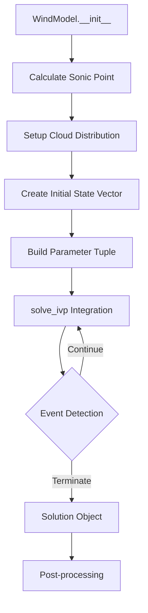
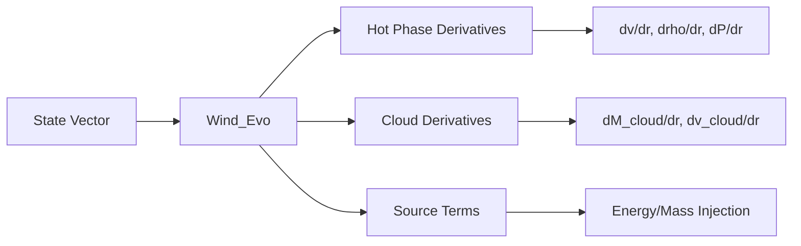

# multiphasegalacticwind Documentation Project — Developer Brief

Goal: Create comprehensive documentation for the `multiphasegalacticwind` Python package - a scientific computing library for modeling multiphase galactic winds with hot gas and cold embedded clouds.

## Primary Objectives

1. **Complete physics documentation** with all governing equations in LaTeX
2. **Clickable, high-level flowcharts** of the package's runtime workflows
3. **Per-module API reference** generated from docstrings and type hints
4. **Narrative guides** explaining the physics, numerics, and code structure
5. **Troubleshooting guide** for common integration failures and parameter issues
6. **A polished docs site** that is fast, searchable, responsive (with dark mode)

---

## 0. Output Requirements

- **Docs site**: Fast, full-text search, responsive, dark mode; reproducible build
- **Physics documentation**: Complete mathematical foundation with derivations
- **Flowcharts**: One top-level diagram + focused sub-diagrams (model lifecycle, ODE integration, event detection)
- **API reference**: Auto-generated for all public modules/classes/functions with units clearly specified
- **Narrative pages**: Physics-focused explanations of TRML, cooling, cloud dynamics
- **Code examples**: Runnable scripts for common use cases
- **CI**: Build, link check, docstring coverage, and doctest runs

---

## 1. Tooling

Use:

- **MkDocs + Material theme** for the site (Markdown-first, great UX, built-in Mermaid)
- **mkdocstrings[python]** to render the API directly from source via Griffe
- **Mermaid** for curated flowcharts (rendered by Material)
- **mkdocs-jupyter** for runnable tutorials/notebooks
- **Interrogate** (docstring coverage), **pydocstyle** (style), **pytest --doctest-glob** (doctests)
- Deliverables in `docs/`: `mkdocs.yml`, `requirements.txt`, `overrides/` (CSS tweaks), `Makefile`

---

## 2. Code Review & Documentation Strategy

### Phase 0 — Physics & Mathematical Foundation
**Goal**: Document the complete theoretical framework before diving into code

1. **Governing Equations** (docs/physics/equations.md)
   - Hot phase evolution (Euler equations with source terms)
   - Cloud dynamics (drag equations, mass exchange)
   - TRML physics (Turbulent Radiative Mixing Layer)
   - Cooling functions and metallicity dependence
   
2. **Numerical Methods** (docs/physics/numerics.md)
   - ODE system formulation (state vector structure)
   - Sonic point treatment and regularization
   - Event detection for termination conditions
   - Integration tolerances and stability

3. **Key Physical Parameters** (docs/physics/parameters.md)
   - Mass/energy loading factors (η_M, η_E, η_M_cold)
   - Cloud distribution (power law dN/dM ∝ M^-α)
   - Injection profiles and radial dependence

### Phase 1 — Systematic Code Review Process

#### Step-by-Step Module Review Order

**Week 1: Core Physics Engine**

1. **core_physics.py** (Day 1-2)
   - [ ] Document `Wind_Evo()` - the main ODE system
   - [ ] Document `Hot_Wind_Evo()` - hot-only comparison
   - [ ] Document all event detection functions
   - [ ] Create flowchart of ODE integration flow
   - [ ] Document the 10-parameter tuple structure
   - [ ] Add LaTeX equations for each derivative calculation

2. **wind_model.py** (Day 3-4)
   - [ ] Document `WindModel` class and all parameters
   - [ ] Document `_calculate_sonic_point_conditions()`
   - [ ] Document `run()` method and integration setup
   - [ ] Document `Solution` class and available data
   - [ ] Create flowchart: Model initialization → Integration → Solution
   - [ ] Add units documentation for all parameters

3. **config.py** (Day 5)
   - [ ] Document `WindConfig` class
   - [ ] Document all configuration parameters with defaults
   - [ ] Create parameter dependency diagram
   - [ ] Document sonic_point_offset vs sonic_transition_tolerance

**Week 2: Supporting Physics**

4. **cooling.py** (Day 1-2)
   - [ ] Document cooling function interpolation
   - [ ] Document Wiersma+09 table structure
   - [ ] Document lazy loading mechanism
   - [ ] Create cooling rate diagrams
   - [ ] Document metallicity dependence

5. **constants.py** (Day 3)
   - [ ] Document all physical constants
   - [ ] Verify CGS units throughout
   - [ ] Create units conversion reference

6. **observables.py** (Day 4-5)
   - [ ] Document column density calculations
   - [ ] Document velocity distribution methods
   - [ ] Document mean molecular weight assumptions
   - [ ] Add equations for dN/dv calculations

**Week 3: Analysis & Visualization**

7. **plotting.py** (Day 1-2)
   - [ ] Document all plotting functions
   - [ ] Document publication style settings
   - [ ] Create gallery of plot types

8. **analysis_helpers.py** (Day 3)
   - [ ] Document utility functions
   - [ ] Document common analysis workflows

9. **Examples review** (Day 4-5)
   - [ ] Review simple_example.py
   - [ ] Review comprehensive_example.py
   - [ ] Review tutorial notebooks
   - [ ] Extract common patterns for documentation

### Documentation Tasks for Each Module

For **every module**, create:

1. **Module Overview Page** (docs/api/module_name.md)
   ```markdown
   # module_name
   
   ## Summary
   [1-2 sentence description]
   
   ## Physical Background
   [Relevant physics equations in LaTeX]
   
   ## Key Components
   - Class/Function 1: [purpose]
   - Class/Function 2: [purpose]
   
   ## Data Flow
   [Mermaid diagram showing inputs/outputs]
   
   ## Common Issues
   - Issue 1: [description and solution]
   
   ## API Reference
   ::: multiphasegalacticwind.module_name
   ```

2. **Detailed Function Documentation**
   - Complete docstring with Parameters, Returns, Raises
   - Units for all physical quantities
   - Mathematical equations where relevant
   - Example usage
   - Cross-references to related functions

3. **Code Annotations**
   - Inline comments for complex physics
   - TODO items for future improvements
   - CRITICAL comments for bug-prone areas

---

## 3. Core Workflow Diagrams

### Main Integration Workflow


### ODE System Structure


---

## 4. Physics Documentation Structure

### Core Physics Pages

1. **Multiphase Wind Theory** (docs/physics/theory.md)
   - Parker wind solutions
   - Sonic point physics
   - Cloud-wind interaction
   
2. **TRML Physics** (docs/physics/trml.md)
   - Turbulent mixing layers
   - Radiative cooling in mixing layers
   - Mass transfer rates
   
3. **Cooling Processes** (docs/physics/cooling.md)
   - Wiersma+09 cooling tables
   - Metallicity dependence
   - Temperature-density phase space

4. **Cloud Dynamics** (docs/physics/clouds.md)
   - Power-law mass distribution
   - Drag forces
   - Cloud destruction criteria

---

## 5. Critical Documentation Priorities

### High Priority (Week 1)
- [ ] Complete equations for Wind_Evo derivatives
- [ ] Document parameter relationships and constraints
- [ ] Create troubleshooting guide for integration failures
- [ ] Document event detection system

### Medium Priority (Week 2)
- [ ] Document cooling table interpolation
- [ ] Create parameter exploration guide
- [ ] Document observables calculations
- [ ] Add convergence test documentation

### Low Priority (Week 3)
- [ ] Style guide for plots
- [ ] Extended examples
- [ ] Performance optimization guide
- [ ] Developer contribution guide

---

## 6. Code Examples Library

Create focused, runnable examples:

```python
# examples/documentation/
01_basic_wind.py              # Minimal working example
02_parameter_exploration.py   # Vary eta_M, eta_E
03_cloud_distribution.py      # Different alpha values
04_convergence_test.py        # Resolution study
05_hot_only_comparison.py     # With/without clouds
06_observables_demo.py        # Column densities
07_custom_cooling.py          # Modified cooling
08_troubleshooting.py         # Common failures
```

---

## 7. Troubleshooting Guide Structure

### Common Integration Failures
1. **Negative Pressure/Density**
   - Typical causes: High η_M_cold, low η_E
   - Solutions: Adjust parameters, check initial conditions
   
2. **Integration Stuck**
   - Typical causes: Near sonic point, stiff ODEs
   - Solutions: Adjust tolerances, sonic_point_offset

3. **Event Termination**
   - List all events and their trigger conditions
   - How to debug which event fired

### Parameter Guidelines
- Safe parameter ranges
- Physically motivated constraints
- Numerical stability considerations

---

## 8. Testing & Validation

### Test Suite Documentation
1. **Unit Tests** (tests/)
   - Test coverage report
   - Critical physics tests
   
2. **Integration Tests**
   - Hot-only wind benchmark
   - Single cloud test
   - Energy/mass conservation

3. **Validation Cases**
   - Comparison with published results
   - Convergence with resolution
   - Parameter sensitivity

---

## 9. Review Checklist Template

For each module review, complete:

- [ ] **Physics Documentation**
  - [ ] All equations in LaTeX
  - [ ] Physical interpretation
  - [ ] Assumptions stated
  
- [ ] **Code Documentation**  
  - [ ] Complete docstrings
  - [ ] Type hints added
  - [ ] Units specified
  
- [ ] **Testing**
  - [ ] Unit tests exist
  - [ ] Edge cases handled
  - [ ] Error messages clear
  
- [ ] **Examples**
  - [ ] Basic usage shown
  - [ ] Common patterns documented
  - [ ] Troubleshooting tips

---

## 10. Quality Metrics

Track documentation progress:

- **Docstring coverage**: Target 100% for public API
- **Example coverage**: Each major function has example
- **Test coverage**: >80% for core physics
- **Cross-references**: All related functions linked
- **Equations**: All physics has LaTeX documentation

---

## Next Steps

1. **Immediate**: Begin Phase 0 physics documentation
2. **Day 1**: Start core_physics.py review with Wind_Evo
3. **Week 1**: Complete core physics engine documentation
4. **Week 2**: Supporting physics and cooling
5. **Week 3**: Analysis, visualization, and examples
6. **Week 4**: Build docs site and deploy

Success criteria: A physicist new to the code can understand the complete model physics and a developer can extend the code within 1 day of reading the documentation.