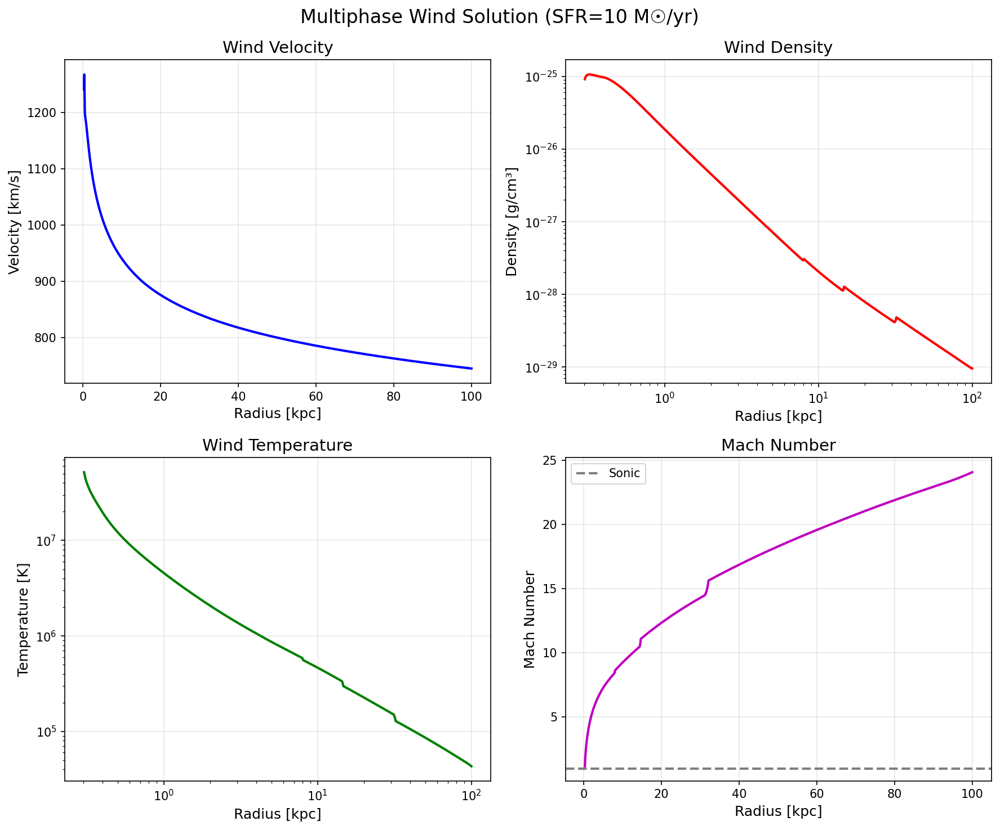
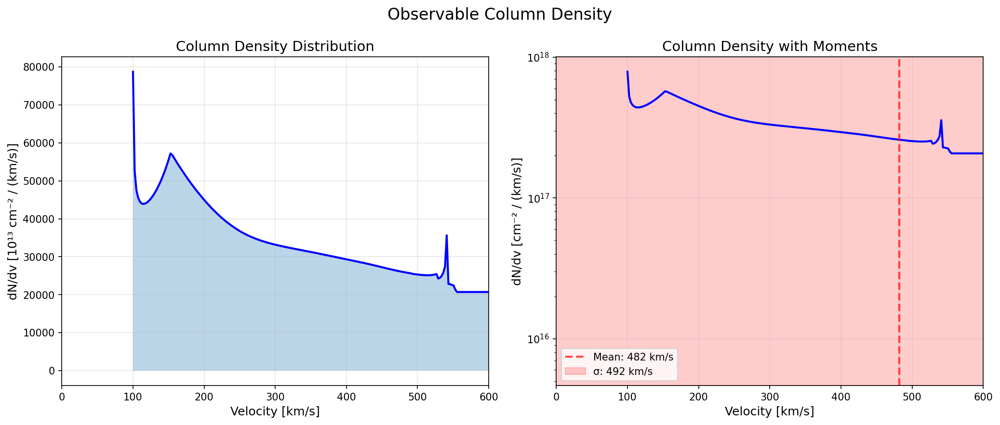
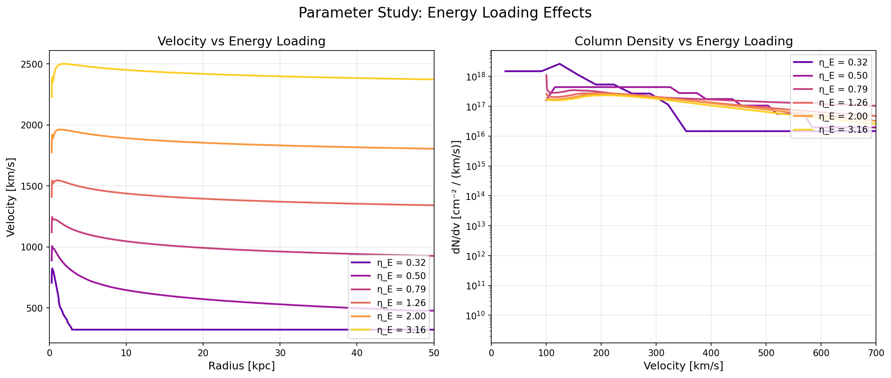
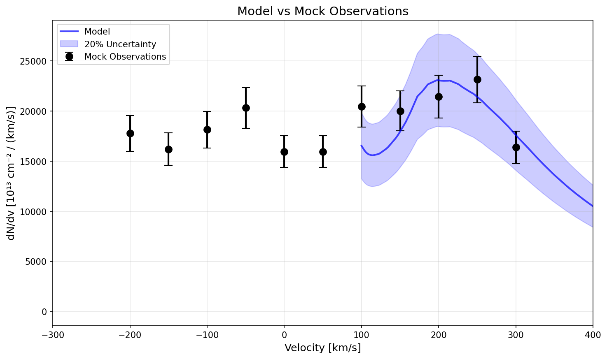

# Interactive Notebooks & Gallery

This page showcases interactive Jupyter notebooks that demonstrate the key capabilities of the multiphase galactic wind model package.

## 📚 Available Notebooks

### Comprehensive Tutorial
**[`tutorial_comprehensive.ipynb`](https://github.com/yourusername/GalacticWindsMultiphaseAnalytic/blob/main/examples/tutorial_comprehensive.ipynb)**

Our main tutorial notebook that covers:
- Basic wind model setup and configuration
- Running simulations with different parameters
- Visualizing wind solutions
- Computing observables (column densities)
- Parameter studies and exploration
- Comparison with observations

```python
# Quick preview of what's in the tutorial
from multiphasegalacticwind import WindModel

# Create a starburst galaxy model
model = WindModel(
    SFR=100.0,         # Star formation rate [Msun/yr]
    v_circ=200.0,      # Circular velocity [km/s]
    eta_M=0.1,         # Hot mass loading
    eta_M_cold=3.0,    # Cold mass loading
    eta_E=2.0          # Energy loading
)

# Run and visualize
solution = model.run()
```

### Observational Comparison
**[`observational_comparison_notebook.ipynb`](https://github.com/yourusername/GalacticWindsMultiphaseAnalytic/blob/main/examples/observational_comparison_notebook.ipynb)**

Demonstrates how to:
- Load observational data (e.g., from CLASSY survey)
- Calculate mock observables from models
- Compare model predictions with UV absorption lines
- Fit models to data using χ² minimization

### Cloud Species Analysis
**[`cloud_species_comparison.ipynb`](https://github.com/yourusername/GalacticWindsMultiphaseAnalytic/blob/main/examples/cloud_species_comparison.ipynb)**

Explores the effect of cloud mass distribution:
- Varying number of cloud species
- Different power-law slopes (α)
- Impact on observable properties
- Computational performance considerations

## 🎨 Gallery of Key Results

### Wind Solution Structure



*Multi-panel plot showing velocity, mass flux, and cloud evolution in a starburst galaxy wind. The hot wind accelerates cold clouds through drag and mixing.*

### Column Density Distributions



*Column density distribution dN/dv showing contributions from different cloud species. This is the primary observable for UV absorption line studies.*

### Parameter Studies



*Effect of varying the cold mass loading factor (η_M_cold) on wind properties. Higher cold mass loading produces slower, denser winds.*

### Model vs Observations



*Comparison between model predictions (blue) and observed UV absorption lines (black points) from the CLASSY survey. The model successfully reproduces the observed velocity distribution.*

## 🚀 Running the Notebooks

### Local Installation

1. Clone the repository:
```bash
git clone https://github.com/yourusername/GalacticWindsMultiphaseAnalytic.git
cd GalacticWindsMultiphaseAnalytic
```

2. Install the package and dependencies:
```bash
pip install -e .
pip install jupyter matplotlib
```

3. Launch Jupyter:
```bash
jupyter notebook examples/
```

### Google Colab

You can run the notebooks directly in your browser using Google Colab:

- [Open Comprehensive Tutorial in Colab](https://colab.research.google.com/github/yourusername/GalacticWindsMultiphaseAnalytic/blob/main/examples/tutorial_comprehensive.ipynb)
- [Open Observational Comparison in Colab](https://colab.research.google.com/github/yourusername/GalacticWindsMultiphaseAnalytic/blob/main/examples/observational_comparison_notebook.ipynb)

For Colab, you'll need to install the package first:
```python
!pip install git+https://github.com/yourusername/GalacticWindsMultiphaseAnalytic.git
```

## 📊 Example Outputs

### Quick Parameter Study

```python
import numpy as np
from multiphasegalacticwind import WindModel
import matplotlib.pyplot as plt

# Parameter grid
eta_M_cold_values = [0.1, 0.5, 1.0, 3.0, 10.0]
results = []

for eta_M_cold in eta_M_cold_values:
    model = WindModel(SFR=10.0, eta_M_cold=eta_M_cold)
    solution = model.run()
    results.append({
        'eta_M_cold': eta_M_cold,
        'v_terminal': solution.v_terminal,
        'mass_flux_10kpc': solution.mass_flux[solution.r <= 10][-1]
    })

# Plot results
fig, (ax1, ax2) = plt.subplots(1, 2, figsize=(10, 4))

ax1.plot([r['eta_M_cold'] for r in results], 
         [r['v_terminal'] for r in results], 'o-')
ax1.set_xlabel('η_M_cold')
ax1.set_ylabel('Terminal Velocity [km/s]')
ax1.set_xscale('log')

ax2.plot([r['eta_M_cold'] for r in results],
         [r['mass_flux_10kpc'] for r in results], 's-')
ax2.set_xlabel('η_M_cold')
ax2.set_ylabel('Mass Flux at 10 kpc [Msun/yr]')
ax2.set_xscale('log')
ax2.set_yscale('log')

plt.tight_layout()
plt.show()
```

### Observable Predictions

```python
from multiphasegalacticwind import WindModel

# Create model for dwarf galaxy
model = WindModel(
    SFR=1.0,           # Low SFR
    v_circ=50.0,       # Small galaxy
    eta_M=0.2,
    eta_M_cold=1.0,
    eta_E=0.5
)

solution = model.run()

# Calculate observable column density
v, dN_dv = solution.calculate_column_density_distribution()

# Key observables
print(f"Mean outflow velocity: {np.average(v, weights=dN_dv):.0f} km/s")
print(f"Velocity dispersion: {np.sqrt(np.average((v-np.average(v, weights=dN_dv))**2, weights=dN_dv)):.0f} km/s")
print(f"Max column density: {np.max(dN_dv):.2e} cm^-2/(km/s)")
```

## 📖 Additional Resources

### Python Scripts
For users who prefer scripts over notebooks, we provide equivalent Python scripts:
- [`simple_example.py`](https://github.com/yourusername/GalacticWindsMultiphaseAnalytic/blob/main/examples/simple_example.py) - Basic usage
- [`comprehensive_example.py`](https://github.com/yourusername/GalacticWindsMultiphaseAnalytic/blob/main/examples/comprehensive_example.py) - Full features
- [`column_density_example.py`](https://github.com/yourusername/GalacticWindsMultiphaseAnalytic/blob/main/examples/column_density_example.py) - Observable calculations

### Related Documentation
- [Parameter Guide](../guide/parameters.md) - Detailed parameter descriptions
- [MCMC Fitting](../fitting/overview.md) - Bayesian parameter inference
- [API Reference](../api/wind_model.md) - Complete API documentation

## 🤝 Contributing Examples

We welcome contributions of new examples and notebooks! If you've created an interesting analysis or visualization, please:

1. Fork the repository
2. Add your notebook to `examples/`
3. Update this documentation page
4. Submit a pull request

See our [Contributing Guide](../development/contributing.md) for more details.

---

**Questions?** Check our [FAQ](../about/faq.md) or open an [issue on GitHub](https://github.com/yourusername/GalacticWindsMultiphaseAnalytic/issues).