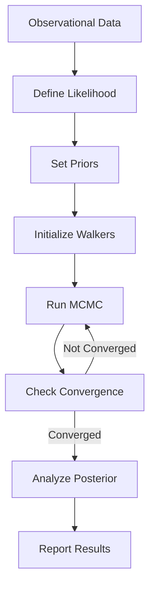

# MCMC Fitting Overview

## What is MCMC Fitting?

MCMC (Markov Chain Monte Carlo) fitting is the primary method for constraining wind model parameters using observational data. This powerful Bayesian approach allows us to:

- **Constrain parameters**: Find best-fit values for η_M, η_M_cold, and η_E
- **Quantify uncertainties**: Get posterior distributions, not just point estimates  
- **Handle degeneracies**: Explore parameter correlations
- **Incorporate priors**: Use physical constraints and previous knowledge

## Why Use MCMC for Wind Models?

### The Challenge
Wind models have multiple degenerate parameters:
- **η_M** (hot mass loading) affects density
- **η_M_cold** (cold mass loading) affects cloud population
- **η_E** (energy loading) affects velocity

These parameters are correlated - different combinations can produce similar observables.

### The Solution
MCMC explores the full parameter space, revealing:
- Parameter degeneracies
- Confidence regions
- Multimodal solutions
- Marginal distributions

## Quick Start

```python
from multiphasegalacticwind.fitting import CLASSYFitter
import emcee

# Load your galaxy data
galaxy_data = {
    'name': 'J0021+0052',
    'sfr': 3.0,      # Msun/yr
    'v_circ': 69.0,  # km/s
    'ions': {...}    # Observational data
}

# Initialize fitter
fitter = CLASSYFitter(galaxy_data)

# Run MCMC
sampler = fitter.run_mcmc(nwalkers=32, nsteps=5000)

# Get results
results = fitter.analyze_chain(sampler)
print(f"Best fit: η_M={results['eta_M']:.2f}")
```

## What You Can Fit

### Observable Quantities
- **Column densities**: N(v) distributions for different ions
- **Velocity centroids**: Mean outflow velocities
- **Velocity widths**: Velocity dispersions
- **Line profiles**: Full absorption line shapes

### Target Datasets
- **CLASSY Survey**: UV spectra of star-forming galaxies
- **COS-Halos**: CGM observations
- **Your data**: Any galaxy with wind measurements

## Key Features

### 1. Multi-Ion Fitting
Simultaneously fit multiple ions (Si II, C II, O VI, etc.) with different ionization states and cloud associations.

### 2. Parallel Processing
Leverage multiple CPU cores for faster sampling:
```python
with Pool() as pool:
    sampler = emcee.EnsembleSampler(nwalkers, ndim, log_posterior, pool=pool)
```

### 3. Convergence Diagnostics
- Gelman-Rubin statistic
- Autocorrelation time
- Effective sample size
- Trace plots

### 4. Visualization
- Corner plots showing parameter correlations
- Model vs data comparisons
- Chain evolution plots

## Workflow



## Next Steps

### For Beginners
1. Read the [Fitting Guide](mcmc_guide.md) for detailed instructions
2. Try the [CLASSY Example](classy_example.md) with real data
3. Explore [parameter correlations](advanced.md#correlations)

### For Advanced Users
1. Implement [custom likelihoods](advanced.md#custom-likelihood)
2. Use [parallel tempering](advanced.md#parallel-tempering) for multimodal posteriors
3. Develop [new observables](advanced.md#new-observables)

## Common Applications

### 1. Single Galaxy Analysis
Fit one galaxy to understand its wind properties:
```python
results = fit_galaxy('J0021+0052')
```

### 2. Sample Studies
Fit multiple galaxies to find trends:
```python
for galaxy in classy_sample:
    results[galaxy] = fit_galaxy(galaxy)
plot_mass_loading_vs_sfr(results)
```

### 3. Model Comparison
Compare different wind models:
```python
model1_evidence = calculate_evidence(model='multiphase')
model2_evidence = calculate_evidence(model='hot_only')
bayes_factor = model1_evidence / model2_evidence
```

## Performance Tips

- **Start simple**: Test with fixed parameters first
- **Use relaxed tolerances**: rtol=1e-6 for MCMC
- **Cache models**: Avoid recalculating identical models
- **Parallelize**: Use all available cores

## Troubleshooting

### Common Issues
- **Poor mixing**: Increase walker count or use parallel tempering
- **Slow convergence**: Tighten priors or reparameterize
- **Model failures**: Check parameter bounds

### Getting Help
- See [Advanced Topics](advanced.md) for complex scenarios
- Check [GitHub Issues](https://github.com/yourusername/GalacticWindsMultiphaseAnalytic/issues)
- Review [example notebooks](../tutorials/fitting_example.md)

## Key Papers

- **Fielding & Bryan (2024)**: Wind model physics
- **Xu et al. (2022)**: CLASSY outflow observations
- **Foreman-Mackey et al. (2013)**: emcee implementation

---

**Ready to start fitting?** → [MCMC Fitting Guide](mcmc_guide.md)